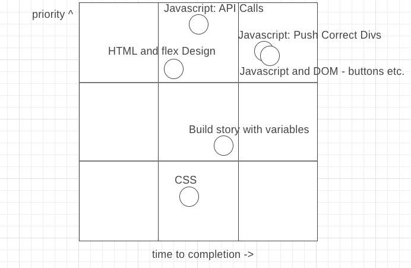

# Project: Star Wars RNG Story

### App Title:
Star Wars - RNG Story!

### App Description:
Tired of latest Star Wars canon? We've got the app for you! 

Just answer some easy multiple choice questions and our custom AI will write a thrilling and heartfelt story based on your choices!

After your choices are entered, just hit finish and voila! Your new Star Wars story is ready to be viewed on your browser or mobile device.

Project link here:  
[Star Wars RNG Story](http://starwars-rng-story.surge.sh/)

---

### API:

SWAPI
* In order to fill out our choices in the quizzes and to fill in background characters in the story, we will choose random numbers and call the API to see who we get.

GIPHY
* For the face-off against the antagonist we need the most meme-y image of them as possible.

Google Custom Search Engine
* If GIPHY fails us, we will have to resort to finding another image. Or if we need a normal or serious image we can use the Google custom search. 
* We also set up a Google CSE for the Star Wars Fandom website. This will find non-meme based, regular images for some of the quiz questions so that serious story decisions can be made.

---

### API Snippet:
[Link to my API Snippets](https://git.generalassemb.ly/drewhsu86/GA-SEI-Apollo-Project1/blob/master/APInotes.md)

Screenshots:

#### 1. SWAPI (in postman):

#### 2. GIPHY (in postman):  
(GIPHY API NOT USED IN FINAL APP)

#### 3. Google CSE (in postman, but returns error):

* but the Google CSE endpoint works with Axios and in chrome

---

### Wireframes:
#### Made using wireframe.cc

I decided to go very minimalistic for this design so that it's just clicking big answers for a quiz (kind of like Kahoot).

[Mobile:](https://wireframe.cc/g0XuUp)

[Browser:](https://wireframe.cc/LjJBkN)

#### HTML and CSS Mockup
 
I made a mockup of the type of div-based button I want to use, with an image saved to the directory (so no API call for the image).

The div uses a border-radius of 50% and a predeterined height and width. The img uses 100% as the width (and for now does not constrain the height). Overflow: hidden cuts off parts of the image not inside the circle.

The basic idea is to make a click event listener and hover effect to make this div an interactive button.

---

### MVP: 
1. User interface: presents questions to the users with the goal of collecting some answers (with visual buttons, maybe divs as buttons). The buttons will be aligned using css flex

2. Use the user's answers and some randomization to create and present a story. These will start after the user clicks finish and the API calls finish (thinking about coding so that the button cannot be pressed multiple times)

3. An array will store a bunch of story scenes assembled from our data, both character info and images found on Giphy and Google CSE. This data will be used to create divs and append them to the page. Each div will have a button at the bottom, which hides the current div and opens the next one.

---

### Post-MVP
1. Technical improvements: 
* Better use and minimization of API calls (maybe call an array on load and store the data?). 
* Remove bugs from loading or other behavior that comes with JS and any HTML elements.

2. CSS improvements: 
* Interactivity, such as good hover for the buttons and transitions between scenes. Thinking about doing a height: 0px transition and then hiding the div.

3. Usability/User experience improvements:
* Find ways to generate more scenarios. Currently I plan to hard code some story elements so that the app works. I might look into if news API or another API can be used to replace proper nouns (words with a capital letter but don't come after a period) with star wars characters. 
* If I find a usable dictionary app I could have the computer generate better word replacements using star wars characters but this is a lot more work than just the base functionality.

---

### Goals: 

| Day       | Goal           | Exp. Hrs  | 
| ------------- |:-------------:| -----|
| April 5 - Sunday  | finish project plan | 8 |
| April 6 - Monday     | get project approval     |   1 |
| April 6 - Monday  | HTML skeleton & css (flexbox only)   |    3 |
| April 6 - Monday  | JS - quiz records answers and continues | 5 |
| April 7 - Tuesday | JS - recorded answers and API calls create story | 4 |
| April 7 - Tuesday | JS - generated story appends proper divs | 4 |
| April 8 - Wednesday | all basic MVP functionality runs beginning to end | 4 |
| April 8 - Wednesday | css pass over all relevant elements | 4 |
| April 9 - Thursday | css and bugs day | 8 |

---

### Priority Matrix:

[Link to priority matrix](https://wireframe.cc/3Ovi0s)

---

### Timeframes:
Expected vs actual hours spent per task

| Goal      | Exp. Hrs          | Actual Hrs  | Completed |
| ------------- |:-------------:| -----| ------------ |
| finish project plan | 8 | 8 | Y |
| get project approval     |   1 | 0.33 |  Y |
| HTML skeleton & css (flexbox only)   |    3 | 1 |  Y |
| JS - quiz records answers and continues | 5 | 8 |  Y |
| JS - recorded answers and API calls create story | 4 | 2 |  Y |
| JS - generated story appends proper divs | 4 | 6 |  Y |
| all basic MVP functionality runs beginning to end | 4 | 1 |  Y |
| css pass over all relevant elements | 4 | 8 | Y | 
| css and bugs | 8 | ? | N |
| Total Hours | 41  | ?  | N |

### Comments and Notes:
1. Working with a simpler layout, without nav or aside bars, helps lower the design time a lot (CSS takes a lot of time and iteration to get perfect).
2. I was able to run the program through while adding each feature, so it took very little time to check that MVP functionality was intact on Wednesday.
3. I wanted to write helper functions to do things such as add my question divs by taking multiple arguments instead of writing HTML elements one by one. It worked well but the code needs to be commented and separated for readability.
4. Hard to "stuff" features in after initial design phase even though they are on my wishlist. For example, I wanted to make the iconic Star Wars scroll as the first page of the story after it's been constructed. But making the user (myself at the time) actually felt terrible. I added the scrolling text as a feature on the front page (below the name input) so that it becomes optional and doesn't force users to wait. 

